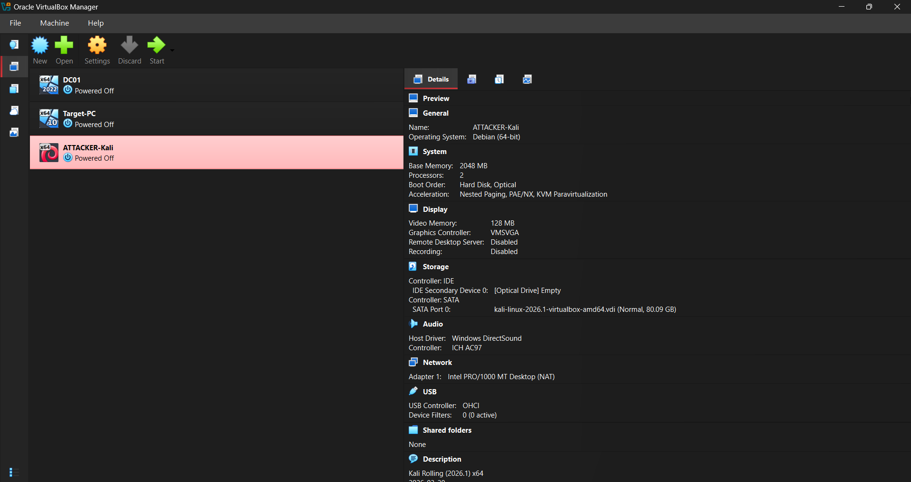

# VirtualBox VM Setup

## Overview
Three VMs created in VirtualBox 7.2.6 to simulate an enterprise 
SOC environment.

## VM Configuration

| VM | OS | RAM | CPU | Disk | Role |
|---|---|---|---|---|---|
| DC01 | Windows Server 2022 | 3072 MB | 2 | 50 GB | Domain Controller |
| Target-PC | Windows 10 | 2048 MB | 2 | 40 GB | Victim Machine |
| ATTACKER-Kali | Kali Linux 2026.1 | 2048 MB | 2 | 80 GB | Attack Machine |

## Screenshot

## Notes
- All VMs stored on D: drive to preserve C: drive space
- Unattended installation disabled on Windows VMs for full 
  manual control
- Kali imported via .vbox file (pre-configured VirtualBox image)
